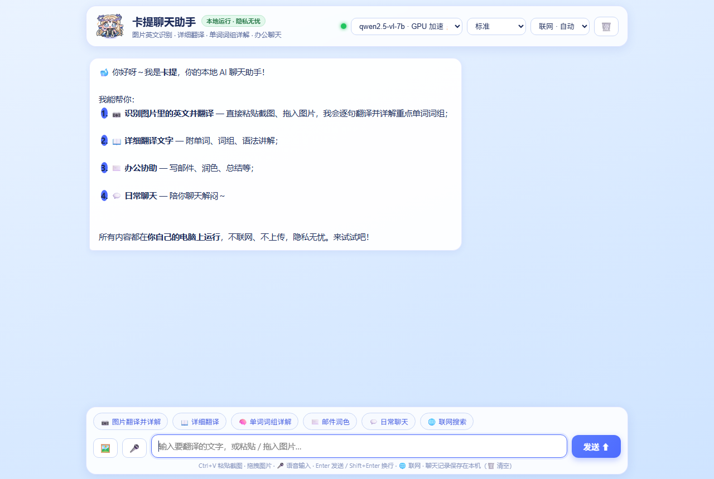

<div align="center">


# 卡提聊天助手 🐋

**本地运行的多模态 AI 助手** · 图片英文识别翻译 · 逐句单词词组详解 · 联网搜索 · 办公聊天

由独立显卡（Vulkan）加速：**图片翻译约 4～10 秒、文字翻译约 4～5 秒**，全部数据留在本机



</div>

---

## ✨ 功能

| 功能 | 说明 |
| --- | --- |
| 📷 **图片英文识别 + 翻译** | 粘贴截图 / 拖入图片 / 选文件 → 逐字识别图片中的英文 → 逐句中文翻译 → **重点单词与词组详解**（音标、词性、含义、常见搭配、例句） |
| 📖 **详细翻译** | 输入英文段落，给出逐句翻译 + 单词、词组、语法讲解 |
| 🌐 **联网搜索** | 问"最新 / 昨天 / 今天"的事不再答错：实时抓取网页搜索结果 + **今日头条实时热榜**；三档开关（自动 / 始终 / 关闭） |
| ⌨️ **全局热键** | **右 Alt + 回车**：任何界面下呼出置顶的「悬浮快速输入窗」，问完即走 |
| 🐋 **托盘常驻** | 关掉窗口仍在后台运行；双击托盘图标即刻打开；右键菜单可停服务/退出 |
| 💬 **聊天记录** | 自动保存在本机（localStorage），重开即见上次对话，🗑️ 一键清空 |
| 🎤 **语音输入** | 点麦克风说话（Edge / Chrome） |
| 🚀 **GPU 加速** | 基于 llama.cpp Vulkan 后端，AMD / NVIDIA / Intel 显卡通用，无需 ROCm |
| 📏 **回答长度三档** | 简洁 / 标准 / 详细 —— 越短生成越快 |
| 💻 **CPU 兜底** | 没有可用的 Vulkan 显卡时自动回退 Ollama（CPU），较慢但能用 |

## 🚀 快速开始（普通用户）

1. 到本仓库的 [**Releases**](../../releases) 页面下载 **KatiChat-Setup-v1.0.0.exe**
2. **双击安装** —— 安装程序会自动：
   - 解压程序到 `%LOCALAPPDATA%\KatiChat`（**内置 Node 运行时 + llama.cpp Vulkan 库**，无需预装任何环境）
   - 下载 / 复制 AI 模型（约 5.6 GB，若安装包旁有 `models` 文件夹则直接复制）
   - 创建**桌面快捷方式**与开始菜单项
   - 在「设置 → 应用和功能」登记（可一键卸载）
   - 启动软件
3. 看到「安装完成」后，双击桌面 **卡提聊天助手** 即可使用

> 无需管理员权限，无需预装 Node.js / Python / Ollama。

### 装好之后怎么用

| 想做什么 | 怎么做 |
| --- | --- |
| 翻译图片里的英文 | 截图后 `Ctrl+V` 粘贴到输入框（或拖入图片）→ 自动识别 + 逐句翻译 + 单词详解 |
| 翻译一段英文 | 直接粘贴英文，回车 |
| 知道昨天/今天发生了什么 | 右上角「联网」选 `自动` 或 `始终`，然后直接问 |
| 随手问一句、不切窗口 | 按 **右 Alt + 回车** 呼出悬浮窗，输入后回车 |
| 换成更快的回答 | 右上角「回答长度」选 `简洁`；或模型选带「快」字样的版本 |
| 清空聊天记录 | 右上角 🗑️ |
| 关闭界面但保持后台 | 直接点窗口 ✕（托盘图标会留着） |
| 彻底退出 | 右键托盘图标 → 退出后台 |

## 🛠 从源码运行（开发者）

### 1. 准备依赖

| 依赖 | 说明 |
| --- | --- |
| Windows 10 / 11 x64 | PowerShell 5.1+ |
| Node.js 18+ | 仅需 `node.exe`；也可用安装包内置的运行时 |
| llama.cpp（Vulkan 版） | 把 `llama-server.exe` 及其 DLL 放到 `runtime\llama\`（可从 [llama.cpp Releases](https://github.com/ggml-org/llama.cpp/releases) 下载 `llama-*-bin-win-vulkan-x64.zip`） |
| GGUF 模型 | 运行 `.\tools\下载模型.ps1` 会自动从 ModelScope 下载到 `models\`（约 5.6 GB） |

### 2. 启动

```powershell
# 一键启动（会自动拉起网页服务 + GPU 推理 + 托盘 + 打开界面）
.\launch.ps1
```

浏览器界面地址：<http://127.0.0.1:7890>

### 3. 打包安装程序

```powershell
# 生成 F:\...\卡提聊天助手_安装包\卡提聊天助手_安装程序.exe（自带运行时，双击安装）
.\installer\build-installer.ps1
```

## 🧱 技术架构

```
┌──────────────────────────────┐
│  前端（原生 HTML/CSS/JS）      │  index.html  主界面
│  public/                     │  quick.html  悬浮快速输入窗
└───────────────┬──────────────┘
                │  NDJSON 流式协议
┌───────────────▼──────────────┐
│  server.mjs（Node 零依赖）     │  静态文件 + 双后端代理 + 联网搜索
│  127.0.0.1:7890              │
└───────┬──────────────┬───────┘
        │ 优先          │ 兜底
┌───────▼────────┐  ┌──▼─────────────┐
│ llama.cpp      │  │ Ollama（CPU）   │
│ llama-server   │  │ 可选            │
│ + Vulkan(GPU)  │  └────────────────┘
│ :8080          │
└────────────────┘
```

- **前端**：单页应用，聊天记录存 localStorage，图片先压缩到最长边 1024px 再送模型
- **server.mjs**：把前端的 parts 格式同时适配 **llama.cpp 的 OpenAI 接口**与 **Ollama 的 NDJSON 接口**，前端完全无感
- **联网搜索**：Bing 中文结果页解析 + 今日头条热榜 API + 百度兜底；抓网页时自动识别 UTF-8/GBK；结果作为系统提示注入，并在回答上方列出来源
- **托盘/热键**：`tray.ps1` 用 WinForms `NotifyIcon` + 低级键盘钩子（`WH_KEYBOARD_LL`）捕获 **右 Alt + 回车**，再置顶聚焦悬浮窗

### 性能实测（AMD RX 6750 XT 12GB, Qwen2.5-VL-7B Q4_K_M）

| 场景 | CPU 模式 | **GPU 模式** | 提升 |
| --- | --- | --- | --- |
| 文字翻译（200 字回答） | 33.0 s | **4.5 s** | 7.3× |
| 图片翻译（200 字回答） | 80.8 s | **10.4 s** | 7.8× |
| 生成速度 | 6.3 tok/s | **46.5 tok/s** | 7.4× |
| 图片编码 | 48.0 s | **6.0 s** | 8× |

推理时 GPU 使用率 97.7%、显存占用 8.99 GB。

## 📁 目录结构

```
├─ server.mjs              本地服务：静态页 + 双后端代理 + 联网搜索
├─ launch.ps1              一键启动（服务 / GPU 推理 / 托盘 / 界面）
├─ tray.ps1                托盘图标 + 全局热键 + 悬浮窗调度
├─ 停止服务.bat             停止本地服务
├─ public/
│   ├─ index.html          主界面
│   ├─ quick.html          悬浮快速输入窗
│   ├─ app.js              前端逻辑（持久化 / 联网开关 / 流式渲染）
│   └─ style.css
├─ assets/                 图标（多尺寸 ICO + 透明 PNG + SVG 源文件）
├─ tools/
│   ├─ 下载模型.ps1         从 ModelScope 拉取 GGUF 模型
│   ├─ make-icon.ps1        任意图片 → 多尺寸 ICO（自动抠白底）
│   ├─ test-persist.mjs     聊天记录持久化自动化测试（CDP）
│   └─ test-quick.mjs       悬浮窗聊天自动化测试（CDP）
├─ installer/
│   ├─ build-installer.ps1  构建单文件安装程序
│   ├─ install.ps1          安装逻辑（解包 / 模型 / 快捷方式 / 卸载登记）
│   └─ install.cmd          安装入口
├─ docs/                   截图与说明图
├─ models/                 模型文件（不入库，见 .gitignore）
└─ runtime/                运行时（Node + llama.cpp，不入库）
```

## ⚙️ 可调参数

| 位置 | 参数 | 默认 |
| --- | --- | --- |
| `launch.ps1` | `$openUrl` | `http://127.0.0.1:7890/?v=6` |
| `launch.ps1` | llama-server 参数 | `-ngl 99 -c 4096 -b 1024 -ub 512` |
| `server.mjs` | `PORT` / `OLLAMA_URL` / `LLAMA_URL` | `7890` / `11434` / `8080` |
| `public/app.js` | `IMG_MAX`（送模型的图片最长边） | `1024` |
| `public/app.js` | `MAX_SEND`（发给模型的历史条数） | `12` |
| `public/app.js` | `ANSWER_MODES`（回答长度） | 200 / 450 / 1000 tokens |

## ❓ 常见问题

**Q：双击安装程序没反应 / 被安全软件拦截？**
用同目录的 `安装.cmd`（备用安装方式，效果完全相同）。

**Q：界面显示「服务未就绪」？**
看 `%LOCALAPPDATA%\KatiChat\logs\llama.err.log`（推理服务）与 `launch.log`（启动流程）。

**Q：右 Alt + 回车没反应？**
看 `logs\tray.log` 是否只有「键盘钩子安装: True」；若托盘进程不在（`logs\tray.pid`），重新双击桌面图标即可拉起。

**Q：没有独显能用吗？**
可以。程序会自动回退到 Ollama（CPU 模式），速度慢很多（生成约 6 tok/s）。

**Q：联网搜索会不会泄露隐私？**
只有把「联网」开关打开（或自动识别到时间敏感问题）时才会访问网络，其余时间全部在本机运行。

**Q：模型文件在哪？**
`%LOCALAPPDATA%\KatiChat\models\`（安装版）或仓库的 `models\`（源码运行）。

## 📄 许可证

[MIT](LICENSE)

模型与运行时版权归各自作者所有：
- 模型：[Qwen2.5-VL-7B-Instruct](https://huggingface.co/Qwen/Qwen2.5-VL-7B-Instruct)（Apache-2.0）
- 推理：[llama.cpp](https://github.com/ggml-org/llama.cpp)（MIT）、[Ollama](https://github.com/ollama/ollama)（MIT）
- 界面图标：本项目自带素材

---

<div align="center">如果这个项目对你有帮助，欢迎点个 ⭐ Star ～</div>
